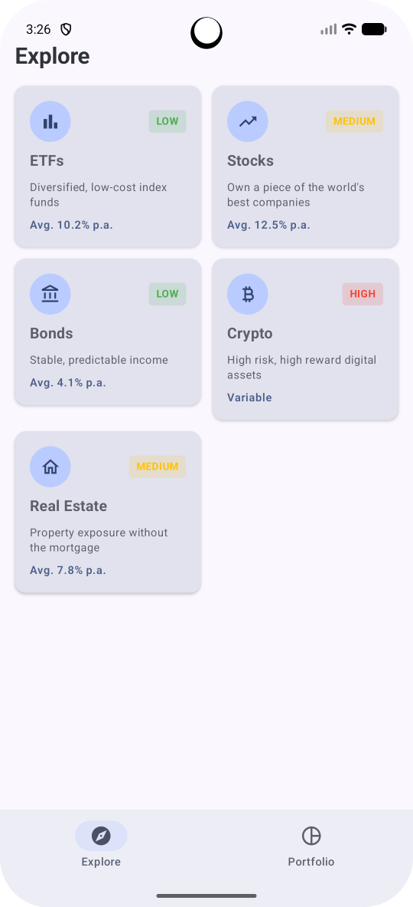
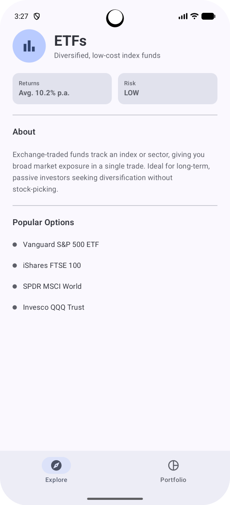
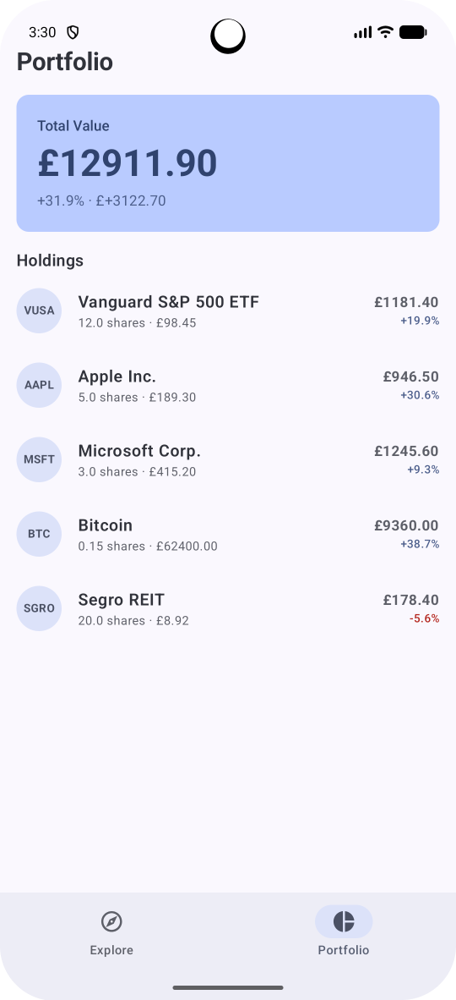
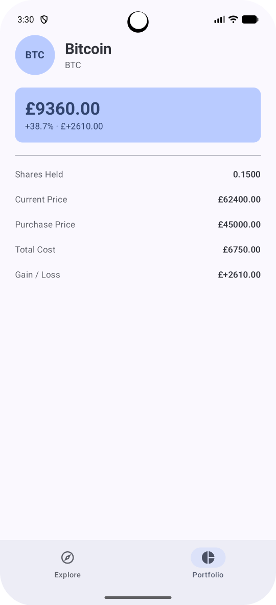
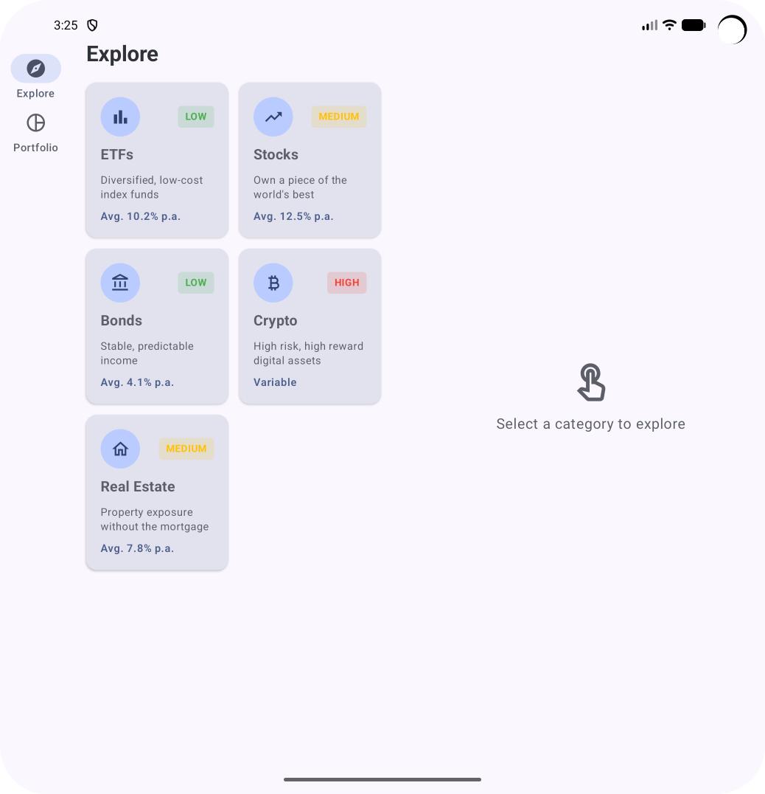
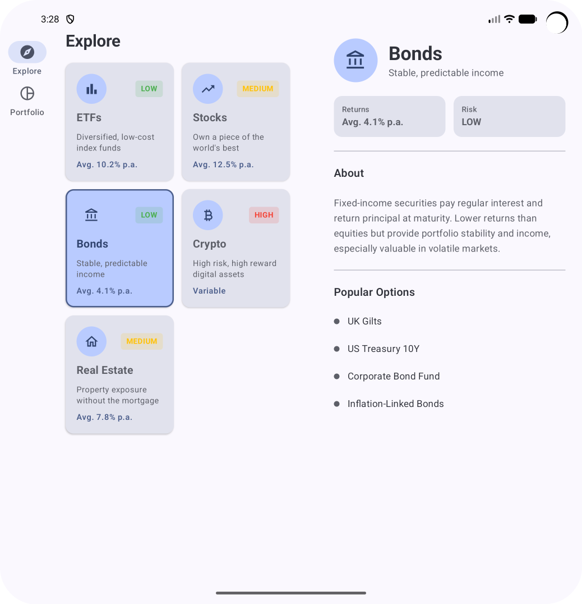
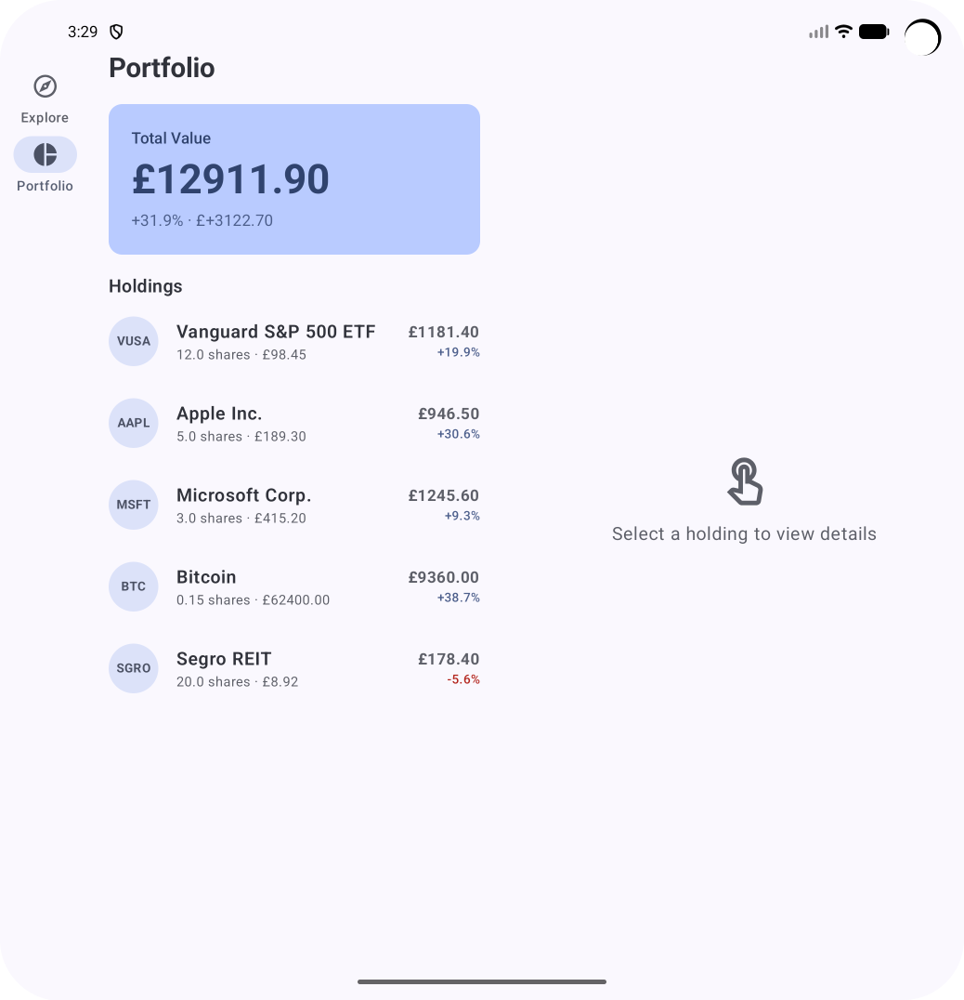
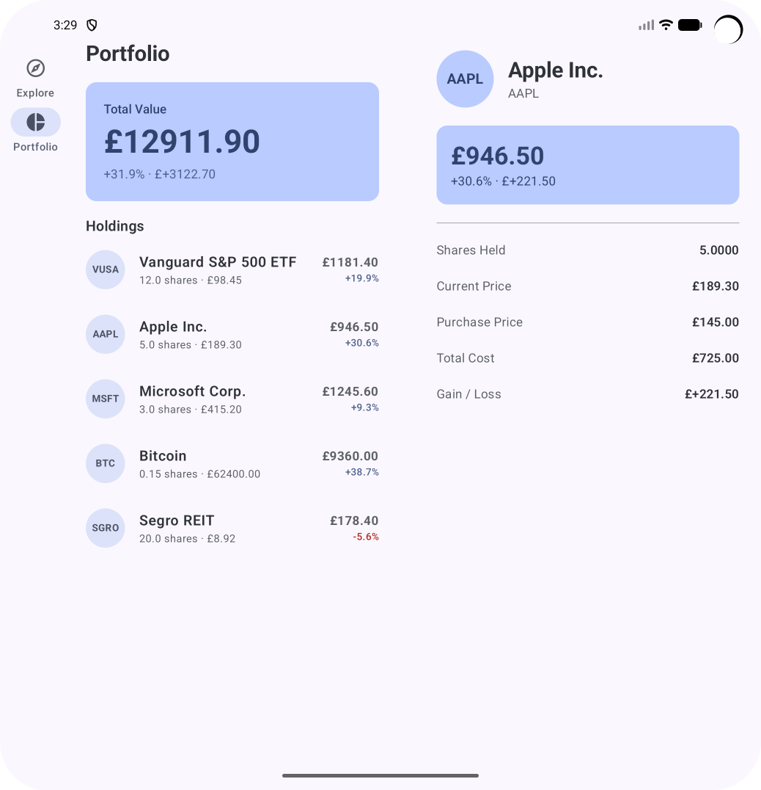

<div align="center">

# 📈 WealthWise

<p align="center">

</p>

[](https://kotlinlang.org)
[](https://developer.android.com)
[](https://developer.android.com/jetpack/compose)
[](https://developer.android.com/jetpack/compose/navigation)
[](https://developer.android.com/jetpack/compose/navigation)


## Investment Dashboard - Navigation 2 · Navigation 3 · Adaptive UI

### A deliberate study of Android navigation architecture and adaptive UI. The same app is implemented four ways - Navigation 2, Navigation 3, Navigation 2 + Adaptive UI, and Navigation 3 + Adaptive UI - each as its own branch, with the navigation layer cleanly isolated from the screen layer in both implementations.

</div>

---

## 📖 What This Project Is

WealthWise is a two-tab investment overview app. An **Explore** tab for browsing investment categories, and a **Portfolio** tab for viewing mock holdings. All data is static Kotlin objects.

The app is the vehicle. The real subject is **navigation architecture and adaptive layout** - specifically what changes when you move from Navigation 2's controller-driven model to Navigation 3's state-driven model, and how adaptive UI sits cleanly on top of either approach.

---

## 🌿 Branch Structure

```
main                      ← this README, project overview
│
└── implementation/
    ├── nav2              ← Navigation 2 only (NavController + NavHost)
    ├── nav3              ← Navigation 3 only (NavDisplay + NavBackStack)
    ├── adaptive-ui-nav2  ← Navigation 2 + Adaptive UI
    └── adaptive-ui-nav3  ← Navigation 3 + Adaptive UI
```

Each branch is a complete, working implementation. The screen composables are identical across all four branches - only the navigation layer and layout scaffolding differ. This makes the architectural differences explicit and comparable.

---

## 📸 Screenshots

<div align="center">

### Phone - Compact

| Explore | Explore Detail | Portfolio | Portfolio Detail |
|:-------:|:--------------:|:---------:|:----------------:|
|  |  |  |  |

### Foldable - Expanded

| Explore | Explore Detail |
|:-------:|:--------------:|
|  |  | 
| Portfolio | Portfolio Detail |
|  |  |

</div>

---

## 🛠️ Tech Stack

| Category | Technology | Why This Choice |
|----------|-----------|-----------------|
| **Language** | Kotlin 2.3.21 | Coroutines, Flow, null safety |
| **UI** | Jetpack Compose + Material 3 | Declarative UI, adaptive layout composables |
| **Navigation 2** | Navigation Compose | NavController, typed routes, NavHost |
| **Navigation 3** | navigation3-runtime + navigation3-ui | NavDisplay, NavBackStack as owned state |
| **Adaptive Navigation** | material3-adaptive-navigation-suite | `NavigationSuiteScaffold` - auto-selects Bar / Rail / Drawer |
| **Adaptive Layout** | adaptive + adaptive-layout + adaptive-navigation | `ListDetailPaneScaffold` - two-pane on Expanded |
| **Window Size** | material3-window-size-class-android | `WindowSizeClass` - reads current breakpoint |
| **Serialization** | Kotlinx Serialization | Typed route encoding for Navigation 2 |
| **Build** | Gradle KTS + Version Catalog | Centralised dependency management |

---

## 🧭 Navigation Architecture

### The Core Difference Between Nav 2 and Nav 3

```
Navigation 2 - Controller-Driven
─────────────────────────────────
Library owns the back stack
You interact via NavController methods

navController.navigate(CategoryDetail(id))
navController.popBackStack()
popUpTo(ExploreHome) { inclusive = true }

Navigation 3 - State-Driven
─────────────────────────────────
You own the back stack as a plain Kotlin list
Library renders whatever is in that list

backStack.add(CategoryDetail(categoryId = id))
backStack.removeLastOrNull()
backStack.clear(); backStack.add(ExploreHome)
```

The navigation operations are equivalent in behaviour. The difference is ownership and transparency - in Nav 3 the back stack is your state, fully visible and directly manipulable. In Nav 2 it lives inside the library and you interact with it through an API.

### Navigation Code Structure

Both implementations live in the same codebase, cleanly separated:

```
navigation/
  v2/
    AppNavHost.kt       ← NavController + NavHost + NavGraphBuilder
    RoutesNav2.kt       ← @Serializable route definitions
  v3/
    AppNavDisplay.kt    ← NavDisplay + entryProvider DSL
    RoutesNav3.kt       ← data object / data class route definitions
```

Screens in `ui/` are shared by both - they receive lambdas for actions and have no knowledge of which navigation implementation is active. The navigation layer is a detail the screens don't see.

### Route Definitions - Nav 2 vs Nav 3

**Navigation 2 - `@Serializable` required:**
```kotlin
// RoutesNav2.kt
@Serializable object ExploreHome
@Serializable object PortfolioHome
@Serializable data class CategoryDetail(val categoryId: Int)
@Serializable data class HoldingDetail(val holdingId: Int)
```

**Navigation 3 - structural equality sufficient:**
```kotlin
// RoutesNav3.kt
data object ExploreHome
data object PortfolioHome
data class CategoryDetail(val categoryId: Int)
data class HoldingDetail(val holdingId: Int)
```

Nav 2 uses the Kotlin serialization plugin to encode and decode destinations when they travel through the back stack. Nav 3 identifies destinations by Kotlin's structural equality - `data object` and `data class` provide `equals()` and `hashCode()` automatically. No serialization annotation needed.

### Back Stack - Nav 2 vs Nav 3

**Navigation 2** - single NavController, single managed back stack:
```kotlin
// Switching tabs re-navigates the controller
navController.navigate(PortfolioHome) {
    popUpTo(PortfolioHome) { inclusive = true }
}
```

**Navigation 3** - two independent lists, one per tab:
```kotlin
val exploreBackStack  = remember { mutableStateListOf<Any>(ExploreHome) }
val portfolioBackStack = remember { mutableStateListOf<Any>(PortfolioHome) }

val currentBackStack = when (selectedTab) {
    AppTab.Explore   -> exploreBackStack
    AppTab.Portfolio -> portfolioBackStack
}
```

Each tab has its own list. Switching tabs switches which list `NavDisplay` observes. Each tab's navigation history is independently preserved with no special configuration - it's a consequence of the state-driven model rather than a feature that needs enabling.

### Back Press - Nav 2 vs Nav 3

**Navigation 2** handles back press automatically via the `NavController`.

**Navigation 3** requires explicit handling - you own the stack, so you manage it:
```kotlin
BackHandler(enabled = currentBackStack.size > 1) {
    currentBackStack.removeLastOrNull()
}
```

This is more explicit and more controllable. Any custom back press behaviour - confirmation dialogs, conditional blocking - is straightforward rather than requiring workarounds.

---

## 📐 Adaptive Architecture

### Breakpoint Reference

| Breakpoint | Width | Device | Navigation Component | Transaction Layout |
|-----------|-------|--------|---------------------|-------------------|
| Compact | < 600dp | Phone portrait | NavigationBar | Full screen detail |
| Medium | 600–840dp | Foldable, phone landscape | NavigationRail | Full screen detail |
| Expanded | > 840dp | Tablet landscape | NavigationDrawer | List + Detail side by side |

### NavigationSuiteScaffold - One Component, Three Layouts

```kotlin
NavigationSuiteScaffold(
    navigationSuiteItems = {
        item(
            selected = selectedTab == AppTab.Explore,
            onClick = { selectedTab = AppTab.Explore },
            icon = { Icon(...) },
            label = { Text("Explore") }
        )
        item(
            selected = selectedTab == AppTab.Portfolio,
            onClick = { selectedTab = AppTab.Portfolio },
            icon = { Icon(...) },
            label = { Text("Portfolio") }
        )
    }
) {
    // content slot
}
```

`NavigationSuiteScaffold` reads `WindowSizeClass` internally and renders `NavigationBar`, `NavigationRail`, or `NavigationDrawer` accordingly. The items are defined once. The scaffold chooses the correct container. There is no `if/else` on window size in the navigation item definitions.

### ListDetailPaneScaffold - Two-Pane on Expanded

Both `ExploreListDetailLayout` and `PortfolioListDetailLayout` follow the same pattern:

```kotlin
ListDetailPaneScaffold(
    directive = navigator.scaffoldDirective,
    value = navigator.scaffoldValue,
    listPane = {
        AnimatedPane {
            ExploreScreen(
                onCategoryClick = { id ->
                    selectedCategoryId = id
                    coroutineScope.launch {
                        navigator.navigateTo(ListDetailPaneScaffoldRole.Detail)
                    }
                },
                selectedCategoryId = selectedCategoryId
            )
        }
    },
    detailPane = {
        AnimatedPane {
            if (selectedCategoryId != null) {
                CategoryDetailScreen(categoryId = selectedCategoryId!!)
            } else {
                EmptyDetailPane(message = "Select a category to explore")
            }
        }
    }
)
```

`navigator.scaffoldDirective` tells the scaffold how many panes it has space to show. On Expanded it renders both panes side by side. On Compact/Medium it manages them as a single visible pane - `navigateTo(Detail)` switches which pane is visible.

`navigator.navigateTo` is a suspend function - the adaptive library sequences the pane animation as a coroutine. A `rememberCoroutineScope()` is used to launch it from the click callback.

### Selected Item Highlight

On Expanded screens, the list highlights whichever item is currently shown in the detail pane:

**CategoryCard** - border and container colour change:
```kotlin
Card(
    border = if (isSelected)
        BorderStroke(2.dp, MaterialTheme.colorScheme.primary)
    else null,
    colors = CardDefaults.cardColors(
        containerColor = if (isSelected)
            MaterialTheme.colorScheme.primaryContainer
        else
            MaterialTheme.colorScheme.surfaceVariant
    )
)
```

**HoldingItem** - background tint on the ListItem:
```kotlin
ListItem(
    modifier = Modifier
        .clickable(onClick = onClick)
        .then(
            if (isSelected)
                Modifier.background(MaterialTheme.colorScheme.surfaceVariant)
            else Modifier
        )
)
```

Different highlight styles because `Card` and `ListItem` are different Material 3 components. A border suits a card-based grid. A background tint suits a full-width list row.

### WindowSizeClass - Calculated Once at Activity Level

```kotlin
class MainActivity : ComponentActivity() {
    override fun onCreate(savedInstanceState: Bundle?) {
        super.onCreate(savedInstanceState)
        enableEdgeToEdge()
        setContent {
            val windowSizeClass = calculateWindowSizeClass(this)
            WealthWiseTheme {
                WealthWiseApp(windowSizeClass = windowSizeClass)
            }
        }
    }
}
```

`calculateWindowSizeClass` requires a `ComponentActivity` reference - it is an Activity-level concern. Passing the result as a parameter keeps composables testable and independent of the Activity. `isExpanded` is then derived once in `WealthWiseApp` and passed down - the single breakpoint branch that drives adaptive routing.

---

## 📂 Project Structure

```
com.uansari.wealthwise/
│
├── data/
│   └── SampleData.kt                    ← hardcoded categories + holdings, computed totals
│
├── model/
│   ├── InvestmentCategory.kt
│   └── Holding.kt                       ← computed gainLoss, gainLossPercent, isProfit
│
├── navigation/
│   ├── v2/
│   │   ├── AppNavHost.kt                ← NavController + NavHost
│   │   └── RoutesNav2.kt                ← @Serializable destinations
│   └── v3/
│       ├── AppNavDisplay.kt             ← NavDisplay + entryProvider
│       └── RoutesNav3.kt                ← data object / data class destinations
│
├── ui/
│   ├── WealthWiseApp.kt                 ← NavigationSuiteScaffold, WindowSizeClass, tab state
│   │
│   ├── explore/
│   │   ├── display/
          ├── ExploreScreen.kt             ← LazyVerticalGrid of categories
│   │   ├── detail/
          ├── CategoryDetailScreen.kt      ← category info, stats, popular options
│   │   └── ExploreListDetailLayout.kt   ← ListDetailPaneScaffold for Expanded
│   │
│   ├── portfolio/
│   │   ├── display/
          ├── PortfolioScreen.kt           ← total value card + holdings list
│   │   ├── detail/
          ├── HoldingDetailScreen.kt       ← individual holding breakdown
│   │   └── PortfolioListDetailLayout.kt ← ListDetailPaneScaffold for Expanded
│   │
│   └── components/
│       ├── CategoryCard.kt              ← grid card, supports isSelected highlight
│       ├── HoldingItem.kt               ← list row, supports isSelected highlight
│       └── EmptyDetailPane.kt           ← placeholder before first selection
│
└── theme/
    └── Theme.kt
```

---

## 🎓 What I Learned

<details>
<summary><b>Navigation 2 vs Navigation 3 - The Mental Model Shift</b></summary>

**Ownership is the real difference** - In Navigation 2 the library owns the back stack and you interact with it through a controller API. In Navigation 3 you own the back stack as a plain Kotlin list and the library renders it. This sounds like a small implementation detail but it changes the entire relationship between your code and the library. In Nav 3 the library becomes a renderer, not a controller. The back stack is transparent, directly inspectable, and directly manipulable.

**Multiple back stacks are trivial in Nav 3** - In Nav 2, preserving each tab's navigation history required `saveState = true`, `restoreState = true`, and careful `popUpTo` configuration. In Nav 3 it's a natural consequence of ownership - each tab has its own list, and switching tabs switches which list the `NavDisplay` is observing. No configuration needed because the model already supports it.

**Back press handling being explicit is a feature, not a limitation** - Nav 3 doesn't handle back press automatically. At first this felt like more work. In practice it means back press behaviour is visible in code, co-located with the back stack it manages, and straightforwardly customisable. The Nav 2 approach of intercepting back press required `OnBackPressedDispatcher` and `BackHandler` workarounds. In Nav 3, `BackHandler` with `backStack.removeLastOrNull()` is the intended pattern.

**`@Serializable` on routes reflects a fundamental difference in how destinations are identified** - Nav 2 encodes destinations as strings in the back stack and uses serialization to decode them back to typed objects. Nav 3 keeps destinations as Kotlin objects in a list - structural equality via `data class` and `data object` is all that's needed. Neither approach is wrong; they reflect different architectural choices about where type safety lives.

</details>

<details>
<summary><b>Adaptive UI Architecture</b></summary>

**`NavigationSuiteScaffold` is not just a convenience wrapper** - It manages the layout implications of each navigation component, not just the component itself. A navigation rail shifts the content area to the right. A drawer overlays or pushes content depending on display mode. Getting all of this right manually across three components is significant work. The scaffold handles it correctly by default by reading `WindowSizeClass` internally.

**The branching on window size should happen once** - My first instinct was to read `isExpanded` in multiple places. The correct architecture is one explicit branch in `AppNavDisplay` (or `AppNavHost`) that routes to either the single-pane or two-pane composable. Every component below that branch is already receiving the right layout for its context. `NavigationSuiteScaffold` and `ListDetailPaneScaffold` encapsulate their own branching internally - you don't need to read `WindowSizeClass` to use them.

**`rememberSaveable` for selected item state is not optional on tablets** - Tablets rotate frequently. `remember` survives recomposition but not configuration changes. `rememberSaveable` survives rotation. Using `remember` for `selectedCategoryId` produced a reproducible bug - rotate the tablet with a category selected, detail pane goes blank. One word change fixed it.

**`navigator.navigateTo` being a suspend function reveals something about the adaptive library's design** - It suspends because it sequences the pane animation as a coroutine before resolving. The library coordinates the animation lifecycle, not just the layout state. `rememberCoroutineScope()` tied to the composable's lifecycle means the coroutine is automatically cancelled if the composable leaves composition - no manual cleanup.

</details>

<details>
<summary><b>Component Design for Adaptivity</b></summary>

**Screen composables should be adaptive-agnostic** - `ExploreScreen` and `PortfolioScreen` don't know whether they're rendering inside a `ListDetailPaneScaffold` or as a full-screen destination. They receive `onCategoryClick`, `selectedCategoryId`, and nothing else. The adaptive context lives above them. This separation means the same screen composable works correctly at every breakpoint and in both navigation implementations.

**`isSelected` defaulting to null / false is the right contract** - Both `CategoryCard` and `HoldingItem` accept an `isSelected` parameter that defaults to `false`. This means every call site outside the Expanded layout passes nothing and gets the unselected appearance automatically. No conditional wrapping at the call site. The highlight logic lives inside the component, not scattered across every screen that uses it.

**Different highlight styles for different component types** - A border and container colour change on `CategoryCard` fits a card-based grid. A background tint on `HoldingItem` fits a full-width list row. Both follow Material 3 selection conventions for their respective component types rather than applying a one-size-fits-all approach.

</details>

---

## 🚧 Scope: Learning Project vs Production

### What's Implemented

| Feature | Nav 2 Branch | Nav 3 Branch | Adaptive Nav 2 | Adaptive Nav 3 |
|---------|:------------:|:------------:|:--------------:|:--------------:|
| Explore → Category Detail | ✅ | ✅ | ✅ | ✅ |
| Portfolio → Holding Detail | ✅ | ✅ | ✅ | ✅ |
| Independent tab back stacks | ⚠️ | ✅ | ⚠️ | ✅ |
| NavigationSuiteScaffold | ❌ | ❌ | ✅ | ✅ |
| ListDetailPaneScaffold | ❌ | ❌ | ✅ | ✅ |
| Selected item highlight | ❌ | ❌ | ✅ | ✅ |
| Back press handling | Auto | Explicit | Auto | Explicit |

### Production Enhancements

| Enhancement | Why | Complexity |
|-------------|-----|-----------|
| **Shared element transitions** | Card expanding into detail view | Medium |
| **ViewModel for selected state** | Survive process death correctly | Low |
| **Room + Repository** | Real holdings persistence | Medium |
| **Charts** | Portfolio performance over time | Medium |
| **Accessibility** | TalkBack focus management between panes | Medium |

---

## 🗺️ Roadmap

- [x] Phase 1 - Navigation 2 (`nav2` branch)
- [x] Phase 2 - Navigation 3 (`nav3` branch)
- [x] Phase 3 - Navigation 2 + Adaptive UI (`adaptive-ui-nav2` branch)
- [x] Phase 4 - Navigation 3 + Adaptive UI (`adaptive-ui-nav3` branch)
- [ ] Phase 5 - Shared element transitions (card → detail)
- [ ] Phase 6 - ViewModel for selected state

---

## 🚀 Getting Started

### Prerequisites

- Android Studio Meerkat (2024.3.1) or newer
- JDK 17
- Android SDK 26+
- No API keys required - fully static data

### Run a specific implementation

```bash
# Clone the repo
git clone https://github.com/UsmanAnsari/WealthWise.git
cd WealthWise

# Switch to the implementation you want to explore
git checkout implementation/adaptive-ui-nav3

# Run
./gradlew installDebug
```

### Test Adaptive Layouts

Use the **Resizable (Experimental)** AVD in Android Studio. It lets you switch between Phone, Foldable, and Tablet form factors in a single emulator session without creating multiple AVDs.

---

## 👤 Author

**Usman Ali Ansari**

- 💼 LinkedIn: [usman1ansari](https://www.linkedin.com/in/usman1ansari)

---

<div align="center">

**Built with ❤️ as a deliberate study of Android Navigation Architecture and Adaptive UI**

</div>
